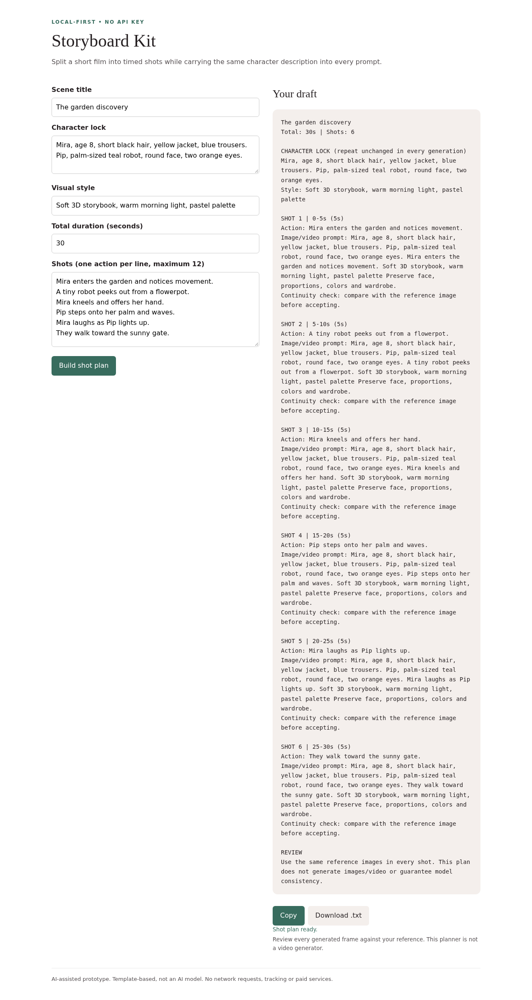

# Storyboard Kit

Offline shot planner that repeats a character lock and divides a scene into timed prompts.

## Status and authorship

An original, AI-assisted prototype prepared for Rahul Kumar's portfolio. It is not copied from another project and is not a claim of production deployment, independent manual authorship, or paid AI-model integration. The examples are fictional.

## Run locally

Open `index.html` in a modern browser. No install or server needed.

## Use

1. Enter character details and style.
2. Write 1-12 shot actions, one per line.
3. Set a whole duration between 5 and 600 seconds.
4. Build and export. Whole-second durations sum exactly to the total.

## Limits

Does not generate images or video. Repeating character details cannot guarantee consistency; use reference images and review each frame.

## Privacy and cost

No API keys, paid services, tracking, telemetry or network calls are required. All inputs stay on your device. Keep real resumes and application data out of public repositories and shared computers.

## Checks

Automated browser checks cover build/output, validation and responsive overflow; Prompt Desk also checks templates, save/load/clear and safe text rendering. See TESTING.md for repeatable manual checks.

## Next steps

Improve accessibility testing, add more examples and collect real-user feedback. No external contribution history or user numbers are claimed.

Optional automated core checks (Node.js 18+, no packages): `node test.mjs`.
